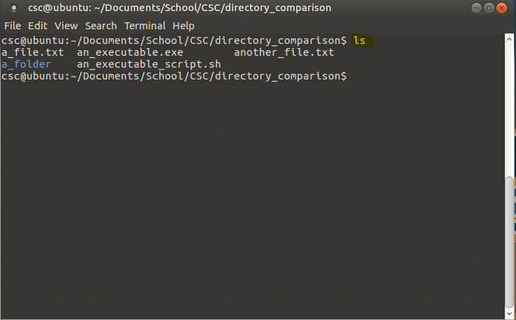
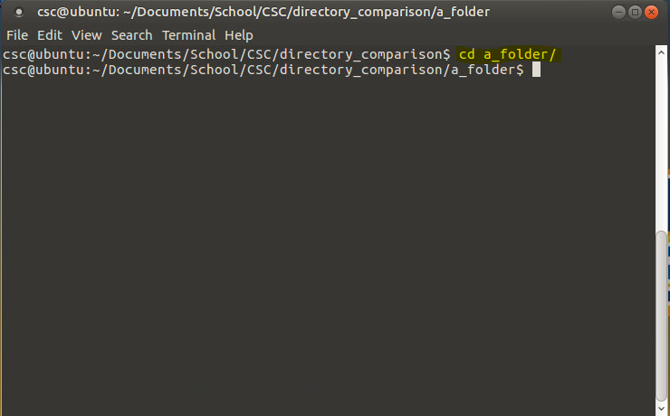
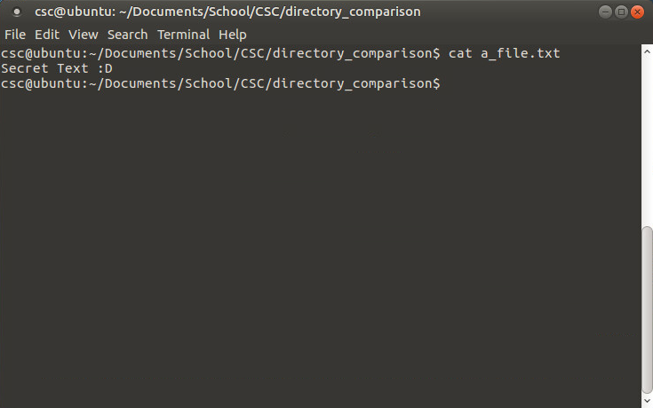
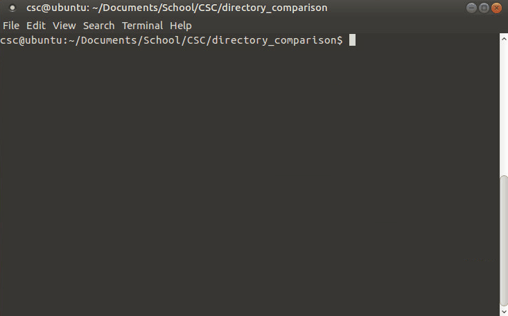
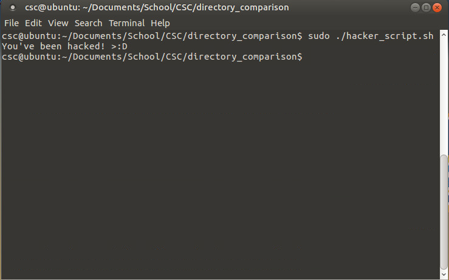

# Cyber Heist
Introductory lab for UAF Cyber Security Club (CSC) Fall 2019

## Introduction
Welcome to CSC! Today you will be 'hacking' into some insecure programs and Raspberry Pi controlled internet of things (IoT) devices. There will be a prize for the first person to reach the end, however, the prize only applies to first time members. If you are a returning member, we will keep track of when you finish and award the top 3 with something different at a later time... :)

## Rules and Guidelines
* Do not intentionally break or lock people out of devices
  * If we catch you doing this intentionally, you will be disqualified - no worries if it's a mistake :)
* You may only edit code that is saved on your VM. Code on the Raspberry Pis DOES NOT need to be edited and you will accomplish nothing by doing so.
* You may work in groups, but prizes will be distributed to only one person. You must decide who in your group gets the prize.
  * Feel free to work together! This is highly encouraged for new members!
  
## Hints
* There are multiple ways to solve each challenge, use your imagination and creativity!
* Answers you find in one challenge might be used in the future. Keep track of your findings :D
* Tristan, Ryan, Bradley, and Matt will be available to assist with questions. Don't be afraid to ask anyone anything, this is a friendly environment!

## Useful Tools

| Linux Command 	|                                                Description                                               	| Example (What it looks like in Windows VS Linux) 	|
|:-------------:	|:--------------------------------------------------------------------------------------------------------:	|:------------------------------------------------:	|
|       `ls`      	|                                 Lists the contents of a folder/directory                                 	|                                                  	|
|       `cd`      	|                                  Changes the folder/directory you are in                                 	|                                                  	|
|      `cat`      	|                                       Shows the contents of a file                                       	|                                                 	|
|      `nano`     	|                                 Command line text editor for editing code                                	|                                                  	|
|      `sudo`     	| Run something with escalated privileges (Think of this as running something as Administrator on Windows) 	|                                                 	|

## Challenges
___

### Level 1 - Basic Linux Command Line Tools
Explore what you have on the computer you have gained access to! Use some of the tools above to navigate to a folder called CyberHeist and list the contents of the directory.

Raise your hand and show us that you have done the following:
- [ ] Show the contents of the file called `beginner.py`
- [ ] Open `beginner.py` with a command line text editor

___

### Level 2 - Reading Python
You probably found some interesting files in the CyberHeist directory. Among them is a python script called `beginner.py`, it is suspected that this script contains login information for a particular user.

Run `beginner.py` using the following command:

`python3 beginner.py`

Explore how the program works by either using it or looking at the code. **You may read and edit the code. Edit at your own risk!**

Raise your hand when:
- [ ] You see the dragon *rawr* :P

___

### Level 3 - Camera Controller
You've gained some intel from a secret source that details a webcam has been setup near the secret safe. It is rumored that this camera may give you some clues on how to open the safe.

**NOTE:** If this is your first meeting, it might be challenging to complete the tasks below. Ask us how to do the steps (we'll walk you through and give you some hints :D)

Riase your hand when you have:
- [ ] Found where the server is located
- [ ] Navigated to the server on a web browser
- [ ] Received a success message from the web browser

___

### Level 4 - Crack The Safe
Finally you've gained access to the system that controls the safe! There's only one thing left to do, steal the goodies >:D.

Raise your hand when you have:
- [ ] Opened the safe

___
